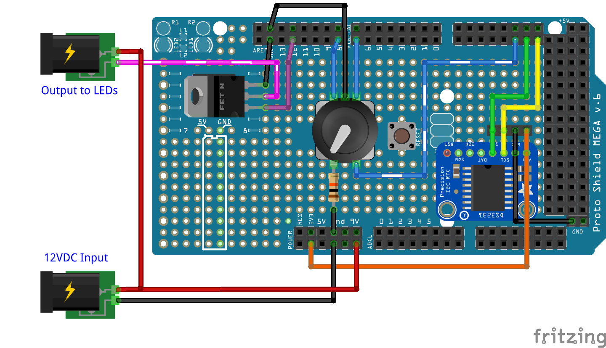
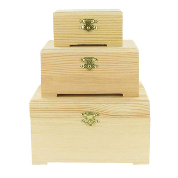

# JanesvilleSunrise
Arduino-based Sunrise Clock

## Introduction
This project is an Arduino-based clock that gradually increases the brightness on LED string lights at a preset time to emulate a sunrise, to gently wake you instead of a blaring alarm. Long Wisconsin winters are not known to have a bright sunrise every day, nor at the right time. 

## Electronics
The Fritzing diagram of the electronics on the prototyping shield: 

An [Arduino Mega 2560](https://store.arduino.cc/usa/arduino-mega-2560-rev3) was used since I had one lying around, but any 5V-compatible Arduino board should work. I used a [Mega prototype shield](https://store.arduino.cc/usa/arduino-mega-proto-shield-rev3-pcb) to build the components.

A 12VDC power supply is used to power the Arduino and the LED string lights. A MOSFET is used to adjust the power to the LEDs up to 12V from a PWM pin on the Arduino board, without drawing the power through the Arduino itself. I used an [IRF530 MOSFET](https://www.vishay.com/docs/91019/91019.pdf) that I had available to power the LEDs. I had a [bright white LED tape light](https://www.amazon.com/gp/product/B00MHLIFO8/ref=oh_aui_detailpage_o05_s00?ie=UTF8&psc=1) which runs on 12VDC and included a power supply. To use RGB lights, three MOSFETs can be used to power the three LED channels separately, each driven from a separate PWM pin. 

An [Adafruit #3013 DS3231 Real Time Clock (RTC)](https://www.adafruit.com/product/3013) breakout board is used to keep accurate time, and the built-in battery backup to continue when power is lost. 

A single [Adafruit #377 Rotary Encoder](https://www.adafruit.com/product/377) is used to provide control to the user for setting the alarm time and device settings. Double-click the built-in button to enter the Setup Mode, which provides access to setting the current time, alarm time, display brightness, and maximum LED output brightness. Hold the button for a short while to start a sunrise fade-in right away. When a sunrise is happening (the LED lights are on), single-click the rotary button to cancel (or re-enable) the current sunrise cycle. 

A header is included next to the RTC to connect an [Adafruit I2C 7-Segment LED backpack](https://www.adafruit.com/product/881) as the clock display. I used the Adafruit #881 blue display, but other colors are available. The Arduino sketch and wiring could be modified to use an SPI or serial display such as the [Sparkfun #COM-11441](https://www.sparkfun.com/products/11441) display, or a [16x2 character LCD](https://www.adafruit.com/category/96), or other products. 

## Hardware and Enclosure
A simple wooden jewelry box from Hobby Lobby was used to enclose the electronics and to mount the display, encoder knob, and power jacks. 

Holes were cut in the top lid for the LED display (with a simple utility knife) and the rotary knob (drill bit). Holes were drilled in the rear for the incoming 12VDC power and the output power for the LED strand. Panel mount DC barrel jacks such as the [Adafruit #610](https://www.adafruit.com/product/610) work well for mounting connectors on the wooden housing, and were the same size as the DC power supply for my LED strands. 

## Arduino Sketch
The [Arduino Sketch](https://github.com/cdudzek/JanesvilleSunrise/blob/master/MySunrise/MySunrise.ino) handles all RTC clock functions, LED clock display, user controls, and fading the LED strand lights in and out. 

The programmed alarm time is when the peak brightness for the LEDs will be on. The TIME_TO_FADE declaration in the sketch defines how long it will take to increase from darkness to full brightness. It is 20 minutes for my preferences but can be changed in the code. After the peak brightness at the exact alarm time, the lights will fade back out in an equal amount of time.

Note that the perceived brightness of the lights is not linear, see [this thread on Stack Exchange](https://electronics.stackexchange.com/questions/1983/correcting-for-non-linear-brightness-in-leds-when-using-pwm) for discussions about non-linear brightness. I implemented a simple exponential formula in the GetUserFade() function to calculate the brightness rather than hard-coding a lookup table with preset values: `fade = fmap * (fmap - 1) / 1000;`

The Arduino EEPROM is used to store user settings any time they are changed. This allows the display brightness, LED output brightness, and alarm time to be saved in case of a power failure. The RTC's own battery keeps the clock running accurately during a power outage. 

## Code Customization
Lights:
- Change `ledPin` to match the pin for your LED output voltage. Must be a PWM-capable pin on Arduinos.
- If using RGB lights, use 3 separate pins, one for each color.

Encoder:
- Change `encLow` and `encHigh` to the pins attached to your rotary encoder. They do not need to be interrupt-capable pins. 
- Change `encBtn` to one pin attached to the rotary encoder's button. This does not need to be an interrupt-capable pin. 
- Attach the rotary common/center pin to ground.
- Connect the other rotary button pin with a 10K resistor to ground (like a standard input button).
- To change the direction of the dial (CW / CCW) just reverse the encLow and encHigh values or swap the wires on the encoder itself.

Other:
- Change the address of your 7-Seg LED at `SEVENSEG_ADDR` if necessary.
- Change the `TIME_TO_FADE` to the number of seconds for the lights to fade in from completely off to completely on. Ex. 20 minutes = 20*60
- Note the Alarm Time setting is for peak brightness, not the beginning of the fade-in. Lights will fade-out for the same duration after the peak alarm time.
- Change the `AlarmOnDays` array to turn the sunrise alarm on or off for each day of the week (Sunday through Saturday). 

# NOTES
1. See the Arduino sketch for a list of required software libraries. 
1. I first attempted to use a [Teensy 3.2](https://www.pjrc.com/store/teensy32.html) microcontroller board due to its small size and great specs. However, the 3.3V board could not adequately power the LED strip lights to the full 12V. I changed over to the Arduino Mega which runs at 5V and was able to power the LEDs fully. 
1. It is possible the [Teensy 3.5](https://www.pjrc.com/store/teensy35.html) would have enough power on a 5V-tolerant board, but I have not tested it. Other Arduino boards such as the 5V-tolerant [Arduino Nano](https://store.arduino.cc/usa/arduino-nano) may also work for this project in small package. 

## Sketch Compilation
- The sketch could be successfully compiled for the Arduino Mega, Nano, Uno, and Teensy 3.5 with no code changes, with the proper supporting libraries installed. Each board would have extra available storage and memory space to add further features to the sketch.
- When compiled for an **Arduino Mega**, 8% of storage space and 14% of dynamic memory were used. 
- When compiled for an **Arduino Uno**, 63% of storage space and 58% of dynamic memory were used. 
- When compiled for an **Arduino Nano**, 67% of storage space and 58% of dynamic memory were used. 
- When compiled for a **Teensy 3.5**, 6% of storage space and 2% of dynamic memory were used. 

# License
This project is licensed under the Apache 2.0 License - see the [LICENSE](LICENSE) file for details.